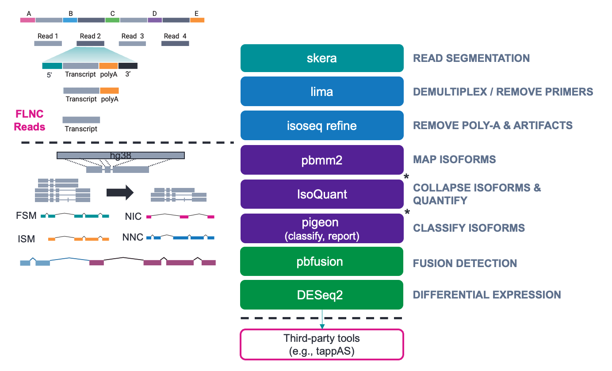
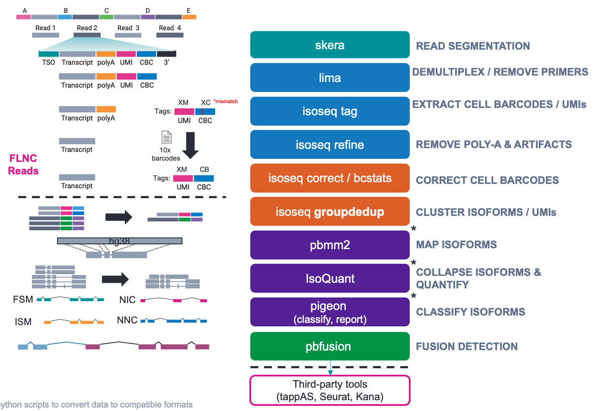

# Kinnex Iso-Seq (RNA) Data Analysis Pipelines

## Jump to:
- [Full-length (bulk) Iso-Seq](#full-length-bulk-iso-seq)
- [10x Single-cell Iso-Seq](#10x-single-cell-iso-seq)
- [Links](#links)

# Resources
A reference genome and additional resources such as adapters, primers, and cell barcode lists are needed to run several analyses in the Kinnex Iso-Seq pipelines including read segmentation, primer trimming/demultiplexing, cell barcode correction (single-cell only), alignment, isoform calling/quantification, and classification. 

Luckily, all the resources you need have already been downloaded by the Hartwell Center onto St. Jude's HPC and can be easily accessed – **no download needed!**

Reference Bundle Directory:
```
/research/rgs01/applications/hpcf/authorized_apps/hartwell/Automation/REF/Kinnex-IsoSeq/
	├── bulkRNA/
	├── scRNA_10x/
	└── RefGenomes/
```

Set variables:
```
export REFS=/research/rgs01/applications/hpcf/authorized_apps/hartwell/Automation/REF/Kinnex-IsoSeq
export HG38=$REFS/RefGenomes/Human_hg38_Gencode_v39
```

<details>
  <summary>More Details</summary>

## Python scripts
Several python scripts are needed at different stages of the pipeline. These python scripts can be found in this repository and are similarly already located on St. Jude's HPC. 

A brief description of these python scripts can be found below:

| Script                    | Description | Source |
|---------------------------|-------------|--------|
| plot_knees.py				| Used to generate knee plots following barcode correction | [PacBio](https://downloads.pacbcloud.com/public/dataset/MAS-Seq/PLOT-scripts/) |
| addXBtag.py				| Used add sample names to deduplicated bam and concatenate sample names and cell barcode (CB) tags into a single experimental barcode (XB) for multi-sample analysis. | This repository (custom) |
| isoquant_generateYAML.py	| Used to create IsoQuant input YAML file from txt list of bam files and sample names | This repository (custom) |
| isoquant2pigeon.py		| Used to convert IsoQuant gtf and tsv files into format compatible with pigeon classify. Changes include changing header of gtf from '# ' to '##' and converting tsv to csv | This repository (custom) |
| convert_grouped_counts.py	| Used to convert IsoQuant linear output tsv files to Matrix Market files similar to CellRanger for input into Seurat | [IsoQuant](https://github.com/ablab/IsoQuant/blob/master/src/convert_grouped_counts.py) |

## Reference Genomes
We use GRCh38 and the entire reference data bundle can be downloaded from our website (if needed) – [RefGenomes](https://downloads.pacbcloud.com/public/dataset/MAS-Seq/REF-pigeon_ref_sets/) 

Note that the `gencode.v39.annotation.sorted.gtf.db` was created by [IsoQuant](https://ablab.github.io/IsoQuant/cmd.html)/[gffutils](https://daler.github.io/gffutils/autodocs/gffutils.create.create_db.html) and is not included the download page linked above.
```
$REFS/
└── RefGenomes
	├── Human_hg38_Gencode_v39
	│   ├── gencode.v39.annotation.gtf
	│   ├── gencode.v39.annotation.sorted.gtf
	│   ├── gencode.v39.annotation.sorted.gtf.db
	│   ├── gencode.v39.annotation.sorted.gtf.gz
	│   ├── gencode.v39.annotation.sorted.gtf.gz.pgi
	│   ├── gencode.v39.annotation.sorted.gtf.gz.tbi
	│   ├── gencode.v39.annotation.sorted.gtf.pgi
	│   ├── human_GRCh38_no_alt_analysis_set.fasta
	│   ├── human_GRCh38_no_alt_analysis_set.fasta.fai
	│   ├── Human_hg38_Gencode_v39.referenceset.xml
	│   ├── intropolis.v1.hg19_with_liftover_to_hg38.tsv.min_count_10.modified2.sorted.tsv
	│   ├── intropolis.v1.hg19_with_liftover_to_hg38.tsv.min_count_10.modified2.sorted.tsv.pgi
	│   ├── polyA.list.txt
	│   ├── refTSS_v3.3_human_coordinate.hg38.sorted.bed
	│   └── refTSS_v3.3_human_coordinate.hg38.sorted.bed.pgi
	└── Mouse_mm39_Gencode_vM28/
```

## Adapters/Primers
There are several adapters, primers, and cell barcode lists that are also needed. 

1. The first step in both pipelines is read segmentation.
	- Full-length (bulk) is a 8x concatenation and uses the `mas8_primers.fasta`
	- Single-cell is a 16x concatenation and uses the [`mas16_primers.fasta`](https://downloads.pacbcloud.com/public/dataset/MAS-Seq/REF-MAS_adapters/MAS-Seq_Adapter_v1/)
2. The second step is primer removal and cDNA demultiplexing.
	- Full-length (bulk) uses [`IsoSeq_v2_primers_12.fasta`](https://downloads.pacbcloud.com/public/dataset/Kinnex-full-length-RNA/REF-primers/)
	- Single-cell uses 10x kit-specific primers[`10x_*kit_primers.fasta`](https://downloads.pacbcloud.com/public/dataset/MAS-Seq/REF-10x_primers/)
3. In the single-cell pipeline only, the fifth step corrects cell-barcodes given a list of known/expected cell barcodes. 
	- This similarly uses [10x kit-specific whitelists](https://downloads.pacbcloud.com/public/dataset/MAS-Seq/REF-10x_barcodes/)
	- For more information about what barcode list to choose, see [10x's page](https://kb.10xgenomics.com/hc/en-us/articles/115004506263-What-is-a-barcode-inclusion-list-formerly-barcode-whitelist)

```
$REFS/
├── bulkRNA
│	├── 01_skera-adapters
│	│   ├── mas8_primers.fasta
│	│   ├── mas8_primers.fasta.fai
│	│   └── MAS-Seq_Adapter_v3.barcodeset.xml
│	└── 02_lima-primers
│	    ├── Iso-Seq_v2_Barcoded_cDNA_Primers.barcodeset.xml
│	    ├── IsoSeq_v2_primers_12.fasta
│	    └── IsoSeq_v2_primers_12.fasta.fai
│
└── scRNA_10x
    ├── 01_skera-adapters
    │   ├── mas16_primers.fasta
    │   ├── mas16_primers.fasta.fai
    │   └── MAS-Seq_Adapter_v1.barcodeset.xml
    ├── 02_lima-primers
    │   ├── 10x_3kit_primers.fasta
    │   └── 10x_5kit_primers.fasta
    └── 05_isoseq-correct
        ├── 3M-3pgex-may-2023.REVCOMP.txt.gz
        ├── 3M-5pgex-jan-2023.REVCOMP.txt.gz
        ├── 3M-february-2018-REVERSE-COMPLEMENTED.txt.gz
        ├── 737K-arc-v1.REVERSE_COMPLEMENTED.txt.gz
        ├── 737K_august_2016.txt.gz
        └── visium_v1.RC.txt.gz
```

## Example Data
Finally, to run the workflow you need data. Example data was obtained from [pacb.com](https://www.pacb.com/connect/datasets/#RNA-datasets). 

- Full-length (bulk) Iso-Seq – Seattle Children’s Research Institute (SCRI)
	- Four heart samples from prenatal specimens obtained from the Birth Defects Research Laboratory tissue repository. 
	- 2 control samples
	- 2 trisomy 21 (T21) samples

- Single-cell Iso-Seq – 10x 5’ (v2) kit
	- 1 PBMC sample
	- 1 HG002 sample

```
$REFS/
├── bulkRNA
│	└── 00_example-data
│		├── 00_samples.txt
│		├── heartBulkRNA.kinnex.control.rep1.bam
│		├── heartBulkRNA.kinnex.control.rep1.bam.pbi
│		├── heartBulkRNA.kinnex.control.rep2.bam
│		├── heartBulkRNA.kinnex.control.rep2.bam.pbi
│		├── heartBulkRNA.kinnex.T21.rep1.bam
│		├── heartBulkRNA.kinnex.T21.rep1.bam.pbi
│		├── heartBulkRNA.kinnex.T21.rep2.bam
│		└── heartBulkRNA.kinnex.T21.rep2.bam.pbi
│
└── scRNA_10x
	└── 00_example-data
		├── 00_samples.txt
		├── HG002.scKinnex.bam
		├── HG002.scKinnex.bam.pbi
		├── PBMC.scKinnex.bam
		└── PBMC.scKinnex.bam.pbi
```

</details>

<br>

***

<br>

# Full-length (bulk) Iso-Seq

## Run Script
To run the example, simply use the script provided in this repository.
```
bsub < KinnexBulkIsoSeq.lsf
```



For more details about each step in the workflow, expand the section below.

<details>
  <summary>More Details</summary>
  
## Details
### 01. skera
*skera* performs read segmentation – which de-concatenates your Kinnex molecules into S-reads (aka "Segmented-Reads"). For full-length (bulk) RNA, we will need to supply the 8x concatenation factor adapter sequences. The general format is: 

`skera split input.bam mas8_primers.fasta segmented.bam`
```
singularity run -B $PWD -B $REFS -B $HG38 docker://quay.io/biocontainers/pbskera:1.4.0--hdfd78af_0 \
	skera split -j 16 $REFS/bulkRNA/00_example-data/heartBulkRNA.kinnex.{1}.bam \
	$REFS/bulkRNA/01_skera-adapters/mas8_primers.fasta \
	01_heartBulkRNA.kinnex.{1}.segmented.bam
```
For more information about *skera*, visit [skera.how](https://skera.how).

### 02. lima
*lima* removes cDNA primers and performs an additional round of demultiplexing (if you multiplexed using cDNA primers). For full-length (bulk) RNA, we will need to supply the full-length Iso-Seq primers which allows up to multiplexing level of 12 samples. The general format is: 

`lima --isoseq segmented.bam IsoSeq_v2_primers_12.fasta demux.fl.bam`

However, note that I am also creating a csv file and providing it to *lima* to overwrite previous biosample names during Kinnex demultiplexing. 
```
echo -e "Barcodes,Bio Sample\n{2},{1}" > 02_heartBulkRNA.kinnex.{1}.barcode.csv
singularity run -B $PWD -B $REFS -B $HG38 docker://quay.io/biocontainers/lima:2.13.0--h9ee0642_0 \
	lima --isoseq --log-level INFO -j 16 \
	--overwrite-biosample-names --biosample-csv 02_heartBulkRNA.kinnex.{1}.barcode.csv \
	01_heartBulkRNA.kinnex.{1}.segmented.bam \
	$REFS/bulkRNA/02_lima-primers/IsoSeq_v2_primers_12.fasta \
	02_heartBulkRNA.kinnex.{1}.fl.bam
```
For more information about *lima*, visit [lima.how](https://lima.how) or [isoseq.how](https://isoseq.how/clustering/cli-workflow.html#step-2---primer-removal-and-demultiplexing).

### 03. isoseq refine
*isoseq refine* removes polyA tails and chimeric/concatemer artifacts. The resulting file contains your FLNC reads ("full-length non-concatemer") – which are the reads containing only your transcripts and no additional barcodes, adapters, or polyA tails. The general format is: 

`isoseq refine --require-polya demux.fl.bam IsoSeq_v2_primers_12.fasta refine.flnc.bam`
```
singularity run -B $PWD -B $REFS -B $HG38 docker://quay.io/biocontainers/isoseq:4.3.0--h9ee0642_0 \
	isoseq refine --require-polya -j 16 \
	02_heartBulkRNA.kinnex.{1}.fl.{2}.bam \
	$REFS/bulkRNA/02_lima-primers/IsoSeq_v2_primers_12.fasta \
	03_heartBulkRNA.kinnex.{1}.flnc.bam

realpath 03_heartBulkRNA.kinnex.{1}*.bam > 03_heartBulkRNA.kinnex.{1}.flnc.fofn
```
We are then placing all the refine bam files (per sample) into a list (`flnc.fofn`) for the next step. This step is unnecessary if there is only one FLNC file per sample (which is common). Note that fofn = "file of file names" (aka a text list with paths to all files to group together).

For more information about *isoseq refine*, visit [isoseq.how](https://isoseq.how/clustering/cli-workflow.html#step-3---refine).

### 04. pbmm2 align - Map isoforms to reference
*pbmm2 align* aligns/maps all of your FLNC reads to a reference genome. The general format is:

`pbmm2 align --preset ISOSEQ --sort reference.fasta flnc.fofn aligned.bam`
```
singularity run -B $PWD -B $REFS -B $HG38 docker://quay.io/pacbio/pbmm2:1.17.0_build1 \
	pbmm2 align -j 16 --preset ISOSEQ --sort \
	$HG38/human_GRCh38_no_alt_analysis_set.fasta \
	03_heartBulkRNA.kinnex.{1}.flnc.fofn \
	04_heartBulkRNA.kinnex.{1}.align.bam
```
For more information about *pbmm2 align*, visit [GitHub](https://github.com/PacificBiosciences/pbmm2).


### 05. IsoQuant
*IsoQuant* will take the alignments and detect your unique isoforms/genes. We will analyze all samples together at this stage, so we need to first prepare an appropriate input file. 

Here I am generating a list of aligned bam files (another fofn) and another list of sample names associated with each of the aligned bam files. The number of lines in each of these two lists much match. Additionally, you may need to manually create the list of sample names and I recommend keeping sample names simple (i.e., only alphanumerics, no underscores or hyphens). 
```
realpath 04_heartBulkRNA.kinnex.*.align.bam > 04_heartBulkRNA.kinnex.align.fofn
perl -pe 's/.*kinnex.//g' 04_heartBulkRNA.kinnex.align.fofn | perl -pe 's/.align.bam//g' > 04_heartBulkRNA.kinnex.align.labels
```

We can then use a custom custom python script *isoquant_generateYAML.py* to generate the input "YAML" (not actually a YAML...it is actually JSON format) file needed for *IsoQuant*. The general format is:

`isoquant_generateYAML.py -b align.fofn -l sample.labels -e experiment_name -o isoquant.yaml`
```
singularity run -B $PWD -B $REFS -B $HG38 docker://quay.io/pacbio/pb_wdl_base:build3 \
	python $REFS/isoquant_generateYAML.py -b 04_heartBulkRNA.kinnex.align.fofn -l 04_heartBulkRNA.kinnex.align.labels -e 05_heartBulkRNA.kinnex.isoquant -o 05_isoquant.yaml
```

After this, we can actually run *IsoQuant* (and pull out results to main folder by creating symbolic links). The general format is:

`isoquant.py -d pacbio --yaml isoquant.yaml -r reference.fasta -g ref_annotations.gtf.db --complete_genedb -o isoquant_output`
```
singularity run -B $PWD -B $REFS -B $HG38 docker://quay.io/biocontainers/isoquant:3.6.3--hdfd78af_0 \
	isoquant.py -t 64 -d pacbio --yaml 05_isoquant.yaml \
	-r $HG38/human_GRCh38_no_alt_analysis_set.fasta \
	-g $HG38/gencode.v39.annotation.sorted.gtf.db --complete_genedb \
	-o 05_heartBulkRNA.kinnex.isoquant \
	--sqanti_output

ln -s 05_heartBulkRNA.kinnex.isoquant/05_heartBulkRNA.kinnex.isoquant/05_heartBulkRNA.kinnex.isoquant.* .
```
For more information about *IsoQuant*, visit their [docs page](https://ablab.github.io/IsoQuant/).

### 06. pigeon classify/report
*pigeon classify* performs a QC on the *IsoQuant* results to inform you how many of the detected isoforms were – compared to the reference genome – full-splice matches (FSM), incomplete splice matches (ISM), novel-in-catalog (NIC), or novel-not-in-catalog (NNIC). 

However, we must first make *IsoQuant*'s output compatible with *pigeon* using another custom python script. This script simply modifies the gtf header and converts TSV to CSV format. The general format is:

`isoquant2pigeon.py --gtf isoquant_out.gtf --tsv isoquant_out.counts.tsv --output isoquant_out.counts.csv`
```
singularity run -B $PWD -B $REFS -B $HG38 docker://quay.io/pacbio/pb_wdl_base:build3 \
	python $REFS/isoquant2pigeon.py \
	--gtf 05_heartBulkRNA.kinnex.isoquant.transcript_models.gtf \
	--tsv 05_heartBulkRNA.kinnex.isoquant.transcript_model_grouped_counts.tsv \
	--output 06_heartBulkRNA.kinnex.pigeon.transcript_model_grouped_counts.csv
```

Now we can run *pigeon classify*. The general format is:

`pigeon classify -o pigeon_output --flnc isoquant_out.counts.csv isoquant_out.gtf ref_annotations.gtf reference.fasta`

You can also (optionally) provide CAGE peaks, polyA motifs, and junction bed files for extended annotations and identification of potential artifacts. 
```
singularity run -B $PWD -B $REFS -B $HG38 docker://quay.io/biocontainers/pbpigeon:1.4.0--h9948957_0 \
	pigeon classify -j 64 -o 06_heartBulkRNA.kinnex.pigeon \
	05_heartBulkRNA.kinnex.isoquant.transcript_models.gtf \
	$HG38/gencode.v39.annotation.sorted.gtf \
	$HG38/human_GRCh38_no_alt_analysis_set.fasta \
	--flnc 06_heartBulkRNA.kinnex.pigeon.transcript_model_grouped_counts.csv \
	--cage-peak $HG38/refTSS_v3.3_human_coordinate.hg38.sorted.bed \
	--poly-a $HG38/polyA.list.txt \
	--coverage $HG38/intropolis.v1.hg19_with_liftover_to_hg38.tsv.min_count_10.modified2.sorted.tsv
```

*pigeon report* subsamples reads to generate table for gene saturation so that you can assess how many reads you truly need to plateau gene detection. The general format is:

`pigeon report pigeon_output_classification.txt pigeon_report.txt`

```
singularity run -B $PWD -B $REFS -B $HG38 docker://quay.io/biocontainers/pbpigeon:1.4.0--h9948957_0 \
	pigeon report -j 64 06_heartBulkRNA.kinnex.pigeon_classification.txt 06_heartBulkRNA.kinnex.pigeon_classification.report.txt
```

For more information about *pigeon*, visit [isoseq.how](https://isoseq.how/classification/pigeon.html) and for a more complete QC check out [SQANTI3](https://github.com/ConesaLab/SQANTI3).

### 07. DESeq2
*DESeq2* is a common software used for detection of differential expression. *Trinity* (another common short-read RNA assembly software) provides a convenient perl wrapper (*run_DE_analysis.pl*) to streamline the process. 

First, we will generate a tsv file with groups in column 1 and sample names (matching the labels used in *IsoQuant*) in column 2. We will also create symbolic links to the *IsoQuant* quantification files with the suffix `.matrix`. This is important for the perl script to work properly, but the files themselves are already formatted properly.
```
awk '{print $3, $1}' $REFS/bulkRNA/00_example-data/00_samples.txt > 07_samples.matrix.txt
ln -s 05_heartBulkRNA.kinnex.isoquant.transcript_model_grouped_counts.tsv 07_isoquant.isoforms.matrix
ln -s 05_heartBulkRNA.kinnex.isoquant.gene_grouped_counts.tsv 07_isoquant.genes.matrix
```
We can perform differential expression on both isoforms (transcripts) and genes. 

#### Isoforms
The general format for the *run_DE_analysis.pl* script is:

`run_DE_analysis.pl --matrix isoquant_out.counts.matrix --method DESeq2 --samples_file samples_matrix.txt --output deseq2_out`
```
singularity run -B $PWD -B $REFS -B $HG38 docker://quay.io/biocontainers/trinity:2.15.2--pl5321h077b44d_3 \
	run_DE_analysis.pl \
	--matrix 07_isoquant.isoforms.matrix \
	--method DESeq2 \
	--samples_file 07_samples.matrix.txt \
	--output 07_deseq2.isoforms
```

This code is optional, but is simply extracting the top 20 differentially expressed genes from the results. 
```
head -n21 07_deseq2.isoforms/*.DE_results | cut -f1 | tail -n +2 > 07_deseq2.top20.isoforms.txt

for i in `cat 07_deseq2.top20.isoforms.txt`
	do 
	grep $i 06_heartBulkRNA.kinnex.pigeon_classification.txt >> 07_deseq2.top20.isoforms.classify.txt
	done
```

#### Genes
The same code can be used to perform differential gene (instead of isoform) expression. 
```
singularity run -B $PWD -B $REFS -B $HG38 docker://quay.io/biocontainers/trinity:2.15.2--pl5321h077b44d_3 \
	run_DE_analysis.pl \
	--matrix 07_isoquant.genes.matrix \
	--method DESeq2 \
	--samples_file 07_samples.matrix.txt \
	--output 07_deseq2.genes
```

```
head -n21 07_deseq2.genes/*.DE_results | cut -f1 | tail -n +2 > 07_deseq2.top20.genes.txt

for i in `cat 07_deseq2.top20.genes.txt`
	do 
	grep $i 05_heartBulkRNA.kinnex.isoquant.transcript_models.gtf | grep -P "\tgene\t" >> 07_deseq2.top20.genes.classify.txt
	done
```

### 08. pbfusion
*pbfusion* is a tool to detect fusion genes which can be useful for certain studies – especially cancer-related where fusions are more common. The general format for the command is:

`pbfusion discover --gtf ref_annotations.gtf --output-prefix pbfusion_out align.bam`
```
singularity run -B $PWD -B $REFS -B $HG38 docker://quay.io/biocontainers/pbfusion:0.5.1--hdfd78af_0 \
	pbfusion discover -t 16 \
	--gtf $HG38/gencode.v39.annotation.sorted.gtf \
	--output-prefix 08_heartBulkRNA.kinnex.{1}.pbfusion \
	04_heartBulkRNA.kinnex.{1}.align.bam
```
For more information about *pbfusion*, visit [GitHub](https://github.com/pacificbiosciences/pbfusion/).

## Output Files

```
01_heartBulkRNA.kinnex.control.rep1.segmented.bam
01_heartBulkRNA.kinnex.control.rep1.segmented.bam.pbi
01_heartBulkRNA.kinnex.control.rep1.segmented.found_adapters.csv.gz
01_heartBulkRNA.kinnex.control.rep1.segmented.ligations.csv
01_heartBulkRNA.kinnex.control.rep1.segmented.non_passing.bam
01_heartBulkRNA.kinnex.control.rep1.segmented.non_passing.bam.pbi
01_heartBulkRNA.kinnex.control.rep1.segmented.read_lengths.csv
01_heartBulkRNA.kinnex.control.rep1.segmented.summary.csv
01_heartBulkRNA.kinnex.control.rep1.segmented.summary.json

02_heartBulkRNA.kinnex.control.rep1.barcode.csv
02_heartBulkRNA.kinnex.control.rep1.demux.consensusreadset.xml
02_heartBulkRNA.kinnex.control.rep1.demux.IsoSeqX_bc03_5p--IsoSeqX_3p.bam
02_heartBulkRNA.kinnex.control.rep1.demux.IsoSeqX_bc03_5p--IsoSeqX_3p.bam.pbi
02_heartBulkRNA.kinnex.control.rep1.demux.json
02_heartBulkRNA.kinnex.control.rep1.demux.lima.clips
02_heartBulkRNA.kinnex.control.rep1.demux.lima.counts
02_heartBulkRNA.kinnex.control.rep1.demux.lima.report
02_heartBulkRNA.kinnex.control.rep1.demux.lima.summary

03_heartBulkRNA.kinnex.control.rep1.refine.bam
03_heartBulkRNA.kinnex.control.rep1.refine.bam.pbi
03_heartBulkRNA.kinnex.control.rep1.refine.consensusreadset.xml
03_heartBulkRNA.kinnex.control.rep1.refine.filter_summary.report.json
03_heartBulkRNA.kinnex.control.rep1.refine.fofn
03_heartBulkRNA.kinnex.control.rep1.refine.report.csv

04_heartBulkRNA.kinnex.align.fofn
04_heartBulkRNA.kinnex.align.labels
04_heartBulkRNA.kinnex.control.rep1.align.bam
04_heartBulkRNA.kinnex.control.rep1.align.bam.bai

05_heartBulkRNA.kinnex.isoquant/
05_isoquant.yaml

06_heartBulkRNA.kinnex.pigeon_classification.report.txt
06_heartBulkRNA.kinnex.pigeon_classification.txt
06_heartBulkRNA.kinnex.pigeon_junctions.txt
06_heartBulkRNA.kinnex.pigeon.report.json
06_heartBulkRNA.kinnex.pigeon.summary.txt
06_heartBulkRNA.kinnex.pigeon.transcript_model_grouped_counts.csv

07_deseq2.genes
07_deseq2.isoforms
07_deseq2.top20.genes.classify.txt
07_deseq2.top20.genes.txt
07_deseq2.top20.isoforms.classify.txt
07_deseq2.top20.isoforms.txt
07_samples.matrix.txt

08_heartBulkRNA.kinnex.control.rep1.pbfusion.breakpoints.groups.bed
```

</details>

<br>

---

<br>

# 10x Single-cell Iso-Seq

## Run Script
To run the example, simply use the script provided in this repository.
```
bsub < KinnexSingleCellIsoSeq.lsf
```



For more details about each step in the workflow, expand the section below.

<details>
  <summary>More Details</summary>

## Details
### 01. skera
*skera* performs read segmentation – which de-concatenates your Kinnex molecules into S-reads (aka "Segmented-Reads"). For full-length (bulk) RNA, we will need to supply the 8x concatenation factor adapter sequences. The general format is: 

`skera split input.bam mas16_primers.fasta segmented.bam`
```
singularity run -B $PWD -B $REFS -B $HG38 docker://quay.io/biocontainers/pbskera:1.4.0--hdfd78af_0 \
	skera split -j 32 $REFS/scRNA_10x/00_example-data/{1}.scKinnex.bam \
	$REFS/scRNA_10x/01_skera-adapters/mas16_primers.fasta \
	01_{1}.scKinnex.segmented.bam
```
For more information about skera, visit [skera.how](https://skera.how)

### 02. lima
*lima* removes cDNA primers and performs an additional round of demultiplexing (if you multiplexed using cDNA primers). For single-cell RNA, we will need to supply the 10x 5' or 3' kit-specific primers. The general format is: 

`lima --isoseq segmented.bam 10x_5kit_primers.fasta demux.fl.bam`

However, note that I am also creating a csv file and providing it to *lima* to overwrite previous biosample names during Kinnex demultiplexing. 
```
echo -e "Barcodes,Bio Sample\n{2},{1}" > 02_{1}.scKinnex.barcode.csv

singularity run -B $PWD -B $REFS -B $HG38 docker://quay.io/biocontainers/lima:2.13.0--h9ee0642_0 \
	lima --isoseq --log-level INFO -j 32 \
	--overwrite-biosample-names --biosample-csv 02_{1}.scKinnex.barcode.csv \
	01_{1}.scKinnex.segmented.bam \
	$REFS/scRNA_10x/02_lima-primers/10x_5kit_primers.fasta \
	02_{1}.scKinnex.fl.bam
```
For more information about *lima*, visit [lima.how](https://lima.how) or [isoseq.how](https://isoseq.how/umi/cli-workflow.html#step-2---primer-removal).

### 03. isoseq tag
*isoseq tag* extracts cell barcodes and UMIs and places them in the XC and XM tags of the bam file. For this, we need to supply a tag design. For the 10x 5' v2 kit, the design is `16B-10U-13X-T` which means there is a 16 bp barcode, 10 bp UMI, 13 bp linker region before the transcript (T). 
>Caution: Tag designs may change between platforms (10x vs. Parse), between kits (5' vs. 3'), and between versions of kits (v2 vs. v3). For example, the design of the 10x 5' **v3** kit is now `16B-12U-10X-T`.

The general format for *isoseq tag* is:

`isoseq tag --design ????????? demux.fl.bam tagged.flt.bam`
```
singularity run -B $PWD -B $REFS -B $HG38 docker://quay.io/biocontainers/isoseq:4.3.0--h9ee0642_0 \
	isoseq tag -j 32 --design 16B-10U-13X-T \
	02_{1}.scKinnex.fl.5p--3p.bam \
	03_{1}.scKinnex.flt.bam
```
For more information, visit [tag design docs](https://isoseq.how/umi/umi-barcode-design.html) and [isoseq.how](https://isoseq.how/umi/cli-workflow.html#step-3---tag). 

### 04. isoseq refine
*isoseq refine* removes polyA tails and chimeric/concatemer artifacts. The resulting file contains your FLNC reads ("full-length non-concatemer") – which are the reads containing only your transcripts and no additional barcodes, adapters, or polyA tails. The general format is: 

`isoseq refine --require-polya tagged.flt.bam 10x_5kit_primers.fasta refine.flnc.bam`
```
singularity run -B $PWD -B $REFS -B $HG38 docker://quay.io/biocontainers/isoseq:4.3.0--h9ee0642_0 \
	isoseq refine --require-polya -j 32 \
	03_{1}.scKinnex.flt.bam \
	$REFS/scRNA_10x/02_lima-primers/10x_5kit_primers.fasta \
	04_{1}.scKinnex.fltnc.bam
```
For more information about *isoseq refine*, visit [isoseq.how](https://isoseq.how/umi/cli-workflow.html#step-4---refine).

### 05. isoseq correct/bcstats
*isoseq correct* first fixes cell barcode mistakes -- by comparing to a "whitelist" of known cell barcodes. The cell barcode whitelists – similar to tag design – are going to be platform, kit, and version dependent. For the 10x 5' v2 kit used in this tutorial, we will use the "737K_august_2016.txt.gz" whitelist. For more information see the [Resources Adapters/Primers](#adaptersprimers) section above.

This step also simultaneously calls cells. Cell calling is used to separate cell barcodes that are present in real cells from background RNA. 

> After correction, it is **HIGHLY** advised to perform *isoseq bcstats* and generate plots to ensure the proper cutoffs were determined. 
> This step is very important to ensure proper number of reads get assigned to each cell. 
> Be cautious and pay attention to the plots generated before moving on!

The general format is:

`isoseq correct --method knee --barcodes cbc_whitelist.txt.gz refine.flnc.bam corrected.flnc.bc.bam`
```
singularity run -B $PWD -B $REFS -B $HG38 docker://quay.io/biocontainers/isoseq:4.3.0--h9ee0642_0 \
	isoseq correct -j 32 --method knee \
	--barcodes $REFS/scRNA_10x/05_isoseq-correct/737K_august_2016.txt.gz \
	04_{1}.scKinnex.fltnc.bam \
	05_{1}.scKinnex.fltnc.bc.bam
```

*isoseq bcstats* collects stats on the cell calling performed above and generates the ncessary files for "knee plots". The general format is:

`isoseq bcstats --output bcstats.tsv corrected.flnc.bc.bam`
```
singularity run -B $PWD -B $REFS -B $HG38 docker://quay.io/biocontainers/isoseq:4.3.0--h9ee0642_0 \
	isoseq bcstats -j 32 --json 05_{1}.scKinnex.fltnc.bc.stats.json \
	--output 05_{1}.scKinnex.fltnc.bc.stats.tsv \
	05_{1}.scKinnex.fltnc.bc.bam
```

Finally, we can generate "knee plots" to assess if the default methodology for determining the cell calling cutoff was appopriate. The general format is:

`plot_knees.py --tsv bcstats.tsv --output plots --estimate_percentile 90`
```
singularity run -B $PWD -B $REFS -B $HG38 docker://quay.io/pacbio/pb_wdl_base:build3 \
	python $REFS/plot_knees.py --tsv 05_{1}.scKinnex.fltnc.bc.stats.tsv \
	--output 05_{1}.scKinnex.fltnc.bc \
	--estimate_percentile 90
```
If the default knee method did not select the appropriate cutoff, then you will need to return to *isoseq correct* and change the method to "percentile" with the appropriate value. For more information, see our [cell calling documentation](https://isoseq.how/umi/cell-calling.html).

For more information about *isoseq correct* or the subsequent checking steps, visit [isoseq.how](https://isoseq.how/umi/cli-workflow.html#step-5---cell-barcode-correction-and-real-cell-identification).

### 06. isoseq groupdedup (+ addXBtag.py)
*isoseq groupdedup* de-duplicates molecules based on their UMIs. We are then placing all the corrected bam files (per sample) into a list (`fltnc..bc.fofn`) for the next step. This step is unnecessary if there is only one FLNC file per sample (which is common). Note that fofn = "file of file names" (aka a text list with paths to all files to group together). The general format for *isoseq groupdedup* is:

`isoseq groupdedup fltnc.bc.fofn dedup.bam`
```
realpath 05_{1}.scKinnex.fltnc.bc.bam > 05_{1}.scKinnex.fltnc.bc.fofn

singularity run -B $PWD -B $REFS -B $HG38 docker://quay.io/biocontainers/isoseq:4.3.0--h9ee0642_0 \
	isoseq groupdedup -j 32 \
	05_{1}.scKinnex.fltnc.bc.fofn \
	06_{1}.scKinnex.fltnc.bc.dedup.bam
```

The *isoseq groupdedup* step removes sample information from the bam header and renames reads as "molecule/###". In addition, cell barcodes can be shared between samples. This makes combining samples challenging. We can get around this using the custom python script *addXBtag.py* which will do three things: (1) add sample names back into the bam header, (2) append the sample name to the beginning of each read name "sample_molecule/###", and (3) create an experimental barcode tag (XB) that concatenates the sample name with the CB tag separated by an underscore. I recommend keeping sample names simple (i.e., only alphanumerics, no underscores or hyphens). 

The general format is:

`addXBtag.py dedup.bam sampleName dedup.xc.bam`
```
singularity run -B $PWD -B $REFS -B $HG38 docker://quay.io/pacbio/pb_wdl_base:build3 \
	python $REFS/addXBtag.py 06_{1}.scKinnex.fltnc.bc.dedup.bam {1} 06_{1}.scKinnex.fltnc.bc.dedup.xc.bam
```

For more information about *isoseq groupdedup*, visit [isoseq.how](https://isoseq.how/umi/cli-workflow.html#step-6---deduplication).

### 07. pbmm2 align
*pbmm2 align* aligns/maps all of your (corrected and deduplicated) FLNC reads to a reference genome. The general format is:

`pbmm2 align --preset ISOSEQ --sort reference.fasta fltnc.bc.dedup.bam aligned.bam`
```
singularity run -B $PWD -B $REFS -B $HG38 docker://quay.io/pacbio/pbmm2:1.17.0_build1 \
	pbmm2 align -j 32 --preset ISOSEQ --sort \
	$HG38/human_GRCh38_no_alt_analysis_set.fasta \
	06_{1}.scKinnex.fltnc.bc.dedup.xc.bam \
	07_{1}.scKinnex.fltnc.bc.dedup.align.bam
```
For more information about *pbmm2 align*, visit [GitHub](https://github.com/PacificBiosciences/pbmm2).

### 08. IsoQuant
*IsoQuant* will take the alignments and detect your unique isoforms/genes. We will analyze all samples together at this stage, so we need to first prepare an appropriate input file. 

Here I am generating a list of aligned bam files (another fofn) and another list of sample names associated with each of the aligned bam files. The number of lines in each of these two lists much match. Additionally, you may need to manually create the list of sample names and I recommend keeping sample names simple (i.e., only alphanumerics, no underscores or hyphens). 
```
realpath 07_*.scKinnex.fltnc.bc.dedup.align.bam > 07_scKinnex.fltnc.bc.dedup.align.fofn
perl -pe 's/.*07_//g' 07_scKinnex.fltnc.bc.dedup.align.fofn | perl -pe 's/.scKinnex.fltnc.*//g' > 07_scKinnex.fltnc.bc.dedup.align.labels
```

We can then use a custom custom python script *isoquant_generateYAML.py* to generate the input "YAML" (not actually a YAML...it is actually JSON format) file needed for *IsoQuant*. The general format is:

`isoquant_generateYAML.py -b align.fofn -l sample.labels -e experiment_name -o isoquant.yaml`
```
singularity run -B $PWD -B $REFS -B $HG38 docker://quay.io/pacbio/pb_wdl_base:build3 \
	python $REFS/isoquant_generateYAML.py -e 08_scKinnex.isoquant -o 08_scKinnex.isoquant.yaml \
	-b 07_scKinnex.fltnc.bc.dedup.align.fofn \
	-l 07_scKinnex.fltnc.bc.dedup.align.labels
```

After this, we can actually run *IsoQuant* (and pull out results to main folder by creating symbolic links). The general format is:

`isoquant.py -d pacbio --yaml isoquant.yaml -r reference.fasta -g ref_annotations.gtf.db --complete_genedb -o isoquant_output --read_group tag:XB --bam_tags CB,XB --counts_format both`
```
singularity run -B $PWD -B $REFS -B $HG38 docker://quay.io/biocontainers/isoquant:3.6.3--hdfd78af_0 \
	isoquant.py -t 64 -d pacbio --yaml 08_scKinnex.isoquant.yaml \
	-r $HG38/human_GRCh38_no_alt_analysis_set.fasta \
	-g $HG38/gencode.v39.annotation.sorted.gtf.db --complete_genedb \
	-o 08_scKinnex.isoquant --read_group tag:XB \
	--sqanti_output --bam_tags CB,XB --counts_format both

ln -s 08_scKinnex.isoquant/08_scKinnex.isoquant/08_scKinnex.isoquant.* .
```

For compatibility with *Seurat*, we need to convert the linear tsv files output by *IsoQuant* to Matrix Market format (a format commonly used by single-cell software). Luckily, *IsoQuant* provides a script to do this! The general format is:

`convert_grouped_counts.py --output output_mtx --input isoquant_output.counts.tsv --output_format mtx`
```
mkdir 08_scKinnex.isoquant.transcript.mtx 08_scKinnex.isoquant.gene.mtx

singularity run -B $PWD -B $REFS -B $HG38 docker://quay.io/biocontainers/isoquant:3.6.3--hdfd78af_0 \
	python $REFS/convert_grouped_counts.py --output 08_scKinnex.isoquant.transcript.mtx/08_scKinnex.isoquant \
	--input 08_scKinnex.isoquant.transcript_model_grouped_counts_linear.tsv \
	--output_format mtx

singularity run -B $PWD -B $REFS -B $HG38 docker://quay.io/biocontainers/isoquant:3.6.3--hdfd78af_0 \
	python $REFS/convert_grouped_counts.py --output 08_scKinnex.isoquant.gene.mtx/08_scKinnex.isoquant \
	--input 08_scKinnex.isoquant.gene_grouped_counts_linear.tsv \
	--output_format mtx
```
For more information about *IsoQuant*, visit their [docs page](https://ablab.github.io/IsoQuant/).

### 09. pigeon classify/report
*pigeon classify* performs a QC on the *IsoQuant* results to inform you how many of the detected isoforms were – compared to the reference genome – full-splice matches (FSM), incomplete splice matches (ISM), novel-in-catalog (NIC), or novel-not-in-catalog (NNIC). 

However, we must first make *IsoQuant*'s output compatible with *pigeon* using another custom python script. This script simply modifies the gtf header and converts TSV to CSV format. The general format is:

`isoquant2pigeon.py --gtf isoquant_out.gtf --tsv isoquant_out.counts.tsv --output isoquant_out.counts.csv`
```
singularity run -B $PWD -B $REFS -B $HG38 docker://quay.io/pacbio/pb_wdl_base:build3 \
	python $REFS/isoquant2pigeon.py \
	--gtf 08_scKinnex.isoquant.transcript_models.gtf \
	--tsv 08_scKinnex.isoquant.transcript_model_counts.tsv \
	--output 09_scKinnex.pigeon.transcript_model_counts.csv
```

Now we can run *pigeon classify*. The general format is:

`pigeon classify -o pigeon_output --flnc isoquant_out.counts.csv isoquant_out.gtf ref_annotations.gtf reference.fasta`

You can also (optionally) provide CAGE peaks, polyA motifs, and junction bed files for extended annotations and identification of potential artifacts. 
```
singularity run -B $PWD -B $REFS -B $HG38 docker://quay.io/biocontainers/pbpigeon:1.4.0--h9948957_0 \
	pigeon classify -j 64 -o 09_scKinnex.pigeon \
	08_scKinnex.isoquant.transcript_models.gtf \
	$HG38/gencode.v39.annotation.sorted.gtf \
	$HG38/human_GRCh38_no_alt_analysis_set.fasta \
	--flnc 09_scKinnex.pigeon.transcript_model_counts.csv \
	--cage-peak $HG38/refTSS_v3.3_human_coordinate.hg38.sorted.bed \
	--poly-a $HG38/polyA.list.txt \
	--coverage $HG38/intropolis.v1.hg19_with_liftover_to_hg38.tsv.min_count_10.modified2.sorted.tsv
```

*pigeon report* subsamples reads to generate table for gene saturation so that you can assess how many reads you truly need to plateau gene detection. The general format is:

`pigeon report pigeon_output_classification.txt pigeon_report.txt`
```
singularity run -B $PWD -B $REFS -B $HG38 docker://quay.io/biocontainers/pbpigeon:1.4.0--h9948957_0 \
	pigeon report -j 64 09_scKinnex.pigeon_classification.txt 09_scKinnex.pigeon_classification.report.txt
```
For more information about *pigeon*, visit [isoseq.how](https://isoseq.how/classification/pigeon.html) and for a more complete QC check out [SQANTI3](https://github.com/ConesaLab/SQANTI3).

### 10. pbfusion
*pbfusion* is a tool to detect fusion genes which can be useful for certain studies – especially cancer-related where fusions are more common. The general format for the command is:

`pbfusion discover --gtf ref_annotations.gtf --output-prefix pbfusion_out align.bam`
```
singularity run -B $PWD -B $REFS -B $HG38 docker://quay.io/biocontainers/pbfusion:0.5.1--hdfd78af_0 \
	pbfusion discover -t 32 \
	--gtf $HG38/gencode.v39.annotation.sorted.gtf \
	--output-prefix 42_{1}.scKinnex.pbfusion \
	07_{1}.scKinnex.fltnc.bc.dedup.align.bam
```
For more information about *pbfusion*, visit [GitHub](https://github.com/pacificbiosciences/pbfusion/).

### 11. Seurat and Cell 
Check out the `resources/seurat.R` in this repository for example of running Seurat on the matrix files generated in step 8 above! Note that both samples (HG002 and PBMC) are in the same file and are identified by Seurat thanks to how the XB tag was created "sample_cbc". 

See [Seurat](https://satijalab.org/seurat/articles/pbmc3k_tutorial) for more details.

## Output Files
```
01_HG002.scKinnex.segmented.bam
01_HG002.scKinnex.segmented.bam.pbi
01_HG002.scKinnex.segmented.found_adapters.csv.gz
01_HG002.scKinnex.segmented.ligations.csv
01_HG002.scKinnex.segmented.non_passing.bam
01_HG002.scKinnex.segmented.non_passing.bam.pbi
01_HG002.scKinnex.segmented.read_lengths.csv
01_HG002.scKinnex.segmented.summary.csv
01_HG002.scKinnex.segmented.summary.json

02_HG002.scKinnex.barcode.csv
02_HG002.scKinnex.fl.5p--3p.bam
02_HG002.scKinnex.fl.5p--3p.bam.pbi
02_HG002.scKinnex.fl.5p--3p.consensusreadset.xml
02_HG002.scKinnex.fl.consensusreadset.xml
02_HG002.scKinnex.fl.json
02_HG002.scKinnex.fl.lima.clips
02_HG002.scKinnex.fl.lima.counts
02_HG002.scKinnex.fl.lima.report
02_HG002.scKinnex.fl.lima.summary

03_HG002.scKinnex.flt.bam
03_HG002.scKinnex.flt.bam.pbi

04_HG002.scKinnex.fltnc.bam
04_HG002.scKinnex.fltnc.bam.pbi
04_HG002.scKinnex.fltnc.consensusreadset.xml
04_HG002.scKinnex.fltnc.filter_summary.report.json
04_HG002.scKinnex.fltnc.report.csv

05_HG002.scKinnex.fltnc.bc.bam
05_HG002.scKinnex.fltnc.bc.bam.pbi
05_HG002.scKinnex.fltnc.bc.fofn
05_HG002.scKinnex.fltnc.bc_intermediate.bam.pbi
05_HG002.scKinnex.fltnc.bc.knee.png
05_HG002.scKinnex.fltnc.bc.report.json
05_HG002.scKinnex.fltnc.bc.stats.json
05_HG002.scKinnex.fltnc.bc.stats.tsv

06_HG002.scKinnex.fltnc.bc.dedup.bam
06_HG002.scKinnex.fltnc.bc.dedup.bam.pbi
06_HG002.scKinnex.fltnc.bc.dedup.xc.bam

07_HG002.scKinnex.fltnc.bc.dedup.align.bam
07_HG002.scKinnex.fltnc.bc.dedup.align.bam.bai
07_scKinnex.fltnc.bc.dedup.align.fofn
07_scKinnex.fltnc.bc.dedup.align.labels

08_scKinnex.isoquant/
08_scKinnex.isoquant.gene.mtx/
08_scKinnex.isoquant.transcript.mtx/
08_scKinnex.isoquant.yaml

09_scKinnex.pigeon_classification.report.txt
09_scKinnex.pigeon_classification.txt
09_scKinnex.pigeon_junctions.txt
09_scKinnex.pigeon.report.json
09_scKinnex.pigeon.summary.txt
09_scKinnex.pigeon.transcript_model_counts.csv

10_HG002.scKinnex.pbfusion.breakpoints.groups.bed
```

</details>

# Links
- [Iso-Seq Bioinformatics Tools App Note](https://www.pacb.com/wp-content/uploads/Application-note-Bioinformatics-tools-for-full-length-isoform-sequencing.pdf)
- [Demo datasets](https://pacb.com/datasets)
- [PacBio Tools](https://pacb.com/computational-tools) ([GitHub](https://github.com/PacificBiosciences))
	- [skera](https://skera.how), [lima](https://lima.how), [isoseq](https://isoseq.how), [pbmm2](https://github.com/PacificBiosciences/pbmm2), [pigeon](https://isoseq.how/classification/pigeon.html), [pbfusion](https://github.com/pacificbiosciences/pbfusion/)
- Other Tools/Resources
	- [IsoQuant](https://ablab.github.io/IsoQuant/)
	- [LRAA](https://github.com/MethodsDev/LongReadAlignmentAssembler) ([Best practices](https://kinnex-documentation-external.readthedocs.io/en/latest/_subpages/pb_guidelines.html))
- Reference Resources (incl. adapters, primers, reference genomes/annotations):
	- [Full-length (bulk)](https://downloads.pacbcloud.com/public/dataset/Kinnex-full-length-RNA/)
	- [Single-cell](https://downloads.pacbcloud.com/public/dataset/MAS-Seq/)
