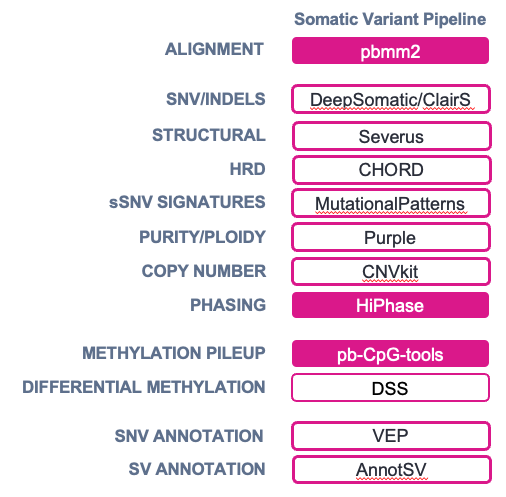
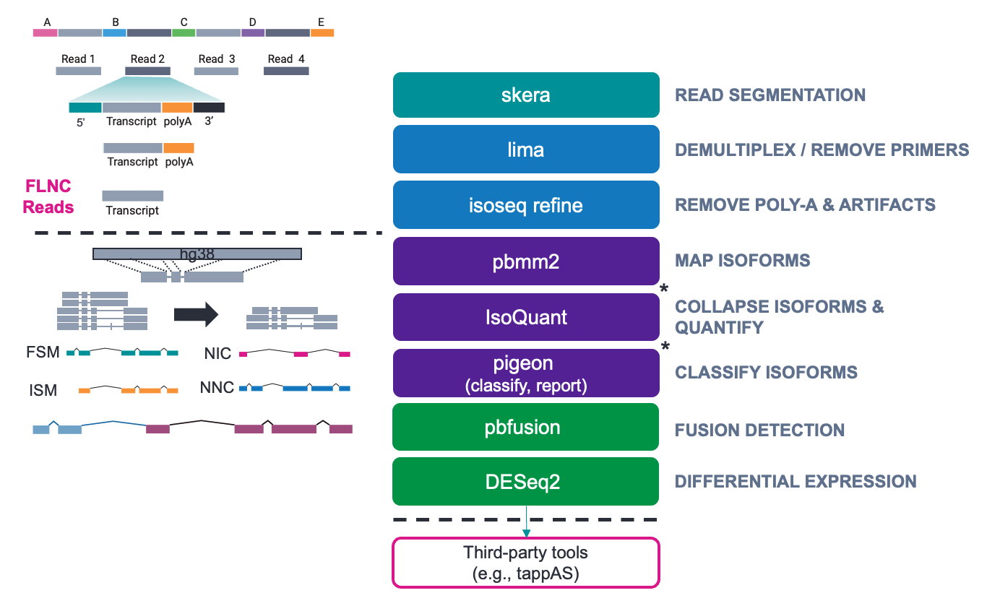
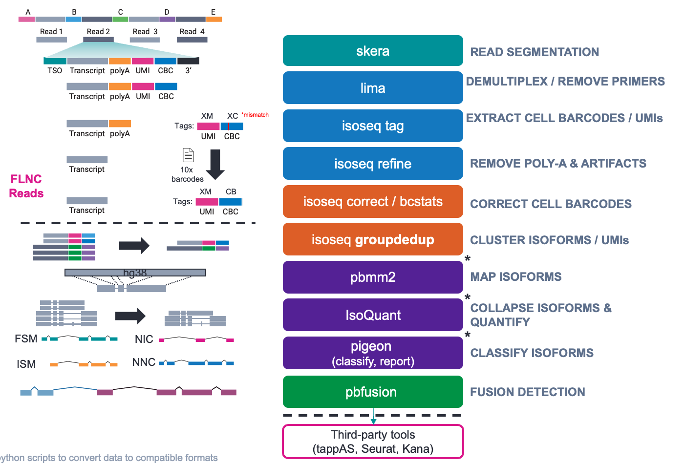

#  WDL Workflow Tutorials @ St. Jude

**Rhett Rautsaw**, Field Applications Bioinformatic Support (FABS) Scientist II, PacBio\
**Daniel Darnell**, Sr. Bioinformatics Analyst, Hartwell Center for Biotechnology at St. Jude Children's Research Hospital

# Summary
This page is designed to guide researchers at St. Jude on how to setup, use, and understand PacBio's various WDL workflows (aka pipelines). Specifically, this page hosts several tutorials for running PacBio WDL workflows on St. Jude's HPC system. 

If you do not have command line experience or want a more push-button solutions, we recommend checking out PacBio's compatible analysis partners at [DNAstack](https://omics.ai/workflows/pacbio/), [DNAnexus](https://www.pacb.com/wp-content/uploads/PacBio-DNAnexus.pdf), and/or [FormBio](https://www.pacb.com/wp-content/uploads/FORM-Bio-flyer.pdf). 

# 1. Prerequisites
Before starting a tutorial, please make sure you have the following prerequisites completed.

## 1.1. Access St. Jude's HPC
### Create an Account
If you do not already have an account for St. Jude's HPC, please visit [ServiceNow](https://stjude.service-now.com/sp) to request a login account.

- [St. Jude HPC Documentation](https://wiki.stjude.org/display/HPCF/)

### Login, start an interactive session, and load Anaconda
```
# Login to St. Jude HPC
ssh username@hpc.stjude.org

# Start an Interactive Session
hpcf_interactive

# Load Anaconda Module
module load conda3/202311

# Prepare Conda Environment
conda create -n miniwdl_env pip
conda activate miniwdl_env
```

> ⚠️ **NOTE** ⚠️: you only need to run the conda create command **once**, but you will need to activate your environment every time you want to run a workflow

## 1.2. Download and Install Dependencies
You will only need to run through this section once! The next time you login to St. Jude's HPC the software does not need to be redownloaded, installed, or setup. 

If you have already downloaded and installed the necessary dependencies, you can skip to start the [tutorials](#tutorials).

### Install miniwdl and miniwdl-lsf extension
```
pip install miniwdl

pip install git+https://github.com/adthrasher/miniwdl-lsf.git
```

## 1.3. Create miniwdl configuration file
In the `miniwdl_setup` directory of this repository, I have included a sample miniwdl configuration file. You will need to place this file in your HOME directory: `~/.config/minidwdl.cfg`

The easiest solution is to clone this repository and move the file into it's final location.

``` 
git clone https://github.com/RhettRautsaw/StJude_PacBio-WDL-tutorial

mkdir -p ~/.config

mv StJude_PacBio-WDL-tutorial/miniwdl_setup/miniwdl.cfg ~/.config/miniwdl.cfg
```

## 1.4. Test miniwdl installation
To test the miniwdl installation and configuration file, I've also included a small WDL workflow that will scatter 10 jobs onto your HPC, call a base docker/singularity container, and generate 10 "hello_*.txt" files. We will tell miniwdl to run and place the results in `~/WHALE_POD_TEST`

```
miniwdl run StJude_PacBio-WDL-tutorial/miniwdl_setup/whale_pod.wdl --dir ~/WHALE_POD_TEST
```

If you run this command a second time, it should complete much faster as it will locate the cached result from the previous successful run. 

# Tutorials
Now you are ready to start the tutorials! We have tutorials available for running the following workflows:

| Workflow | Description | Flowchart |
|----------|-------------|-----------|
| [PacBio WGS Variant Pipeline](https://github.com/RhettRautsaw/StJude_PacBio-WDL-tutorial/tree/main/WGS_Variant_Pipeline) | Use this workflow to call all variant types (SNVs, indels, SVs, CNVs, and tandem repeats) from HiFi WGS data. |  |
| [PacBio Somatic Variant Pipeline](https://github.com/RhettRautsaw/StJude_PacBio-WDL-tutorial/tree/main/Somatic_Variant_Pipeline) | Use this workflow to call somatic variants from tumor-normal HiFi WGS data. |  |
| [Kinnex Full-Length (bulk) Iso-Seq (RNA) Pipeline](https://github.com/RhettRautsaw/StJude_PacBio-WDL-tutorial/tree/main/Kinnex_IsoSeq_Pipelines) | Use this workflow to process full-length (bulk) Kinnex data, call isoforms, quantify isoforms, and perform differential expression |  |
| [Kinnex Single-Cell Iso-Seq (RNA) Pipeline](https://github.com/RhettRautsaw/StJude_PacBio-WDL-tutorial/tree/main/Kinnex_IsoSeq_Pipelines) | Use this workflow to process 10x single-cell Kinnex Iso-Seq (RNA) data, extract cell barcodes, deduplicate, call isoforms, quantify isoforms, and prepare Seurat matrices |  |

## Additional Workflows Available (no tutorials yet)

Now that you know how to use miniwdl to run WDL workflows, check out some of our other WDL workflows for making the most of your HiFi data. 

- Assemble *de novo* genomes with our [Human Genome Assembly Pipeline](https://github.com/PacificBiosciences/HiFi-human-assembly-WDL) 
- Assemble and explore metagenomes with our [HiFi MAG Pipeline](https://github.com/PacificBiosciences/HiFi-MAG-WDL)
	- Obtain metagenomic taxonomic profiles using our complementary snakemake (not WDL) workflows on [pb-metagenomics-tools](https://github.com/PacificBiosciences/pb-metagenomics-tools)

<div style="display: flex; align-items: flex-start;">
  
  
</div>


- Check out [SMRT Tools](https://www.pacb.com/support/software-downloads/) for additional workflows such as:
	- [SMRT Tools Documentation](https://www.pacb.com/wp-content/uploads/SMRT-Tools-Reference-Guide-v13.1.pdf): Workflows start in Appendix A (page 132)
		- HiFi Target Enrichment Pipeline
		- PureTarget Repeat Expansion Pipeline
		- Microbial Genome Analysis Pipeline
		- (Official) Kinnex Read Segmentation & Iso-Seq Analysis Pipeline
		- (Official) Kinnex Read Segmentation & single-cell Iso-Seq Analysis Pipeline
	- > Note: These can only be run with pbcromwell rather than miniwdl. Contact your PacBio FABS for additional support

