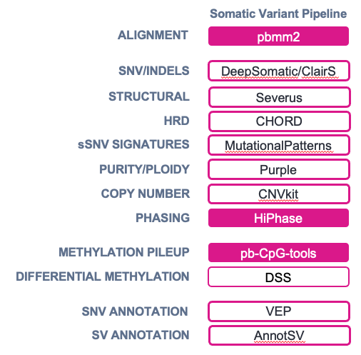

# Somatic Variant Pipeline @ St. Jude


For more information regarding the PacBio Somatic Variant Pipeline, see the links below:

- [App Note](https://www.pacb.com/wp-content/uploads/Application-note-Robust-detection-of-somatic-variants-from-tumor-normal-samples-with-highly-accurate-long-read-whole-genome-sequencing.pdf)
- [GitHub](https://github.com/PacificBiosciences/HiFi-somatic-WDL)
- [Webinar](https://programs.pacb.com/l/1652/2024-08-20/44rwp7?utm_source=Website&utm_medium=eventsPage&utm_term=button&utm_content=RegisterCTA&utm_campaign=2024-08-Webinar-BFX-Cancer-OnDemand)

# 1. Prerequisites
If you have not yet run through the prerequisites on the [home page](https://github.com/RhettRautsaw/StJude_PacBio-WDL-tutorial), please do that before continuing. 

# 2. Download and Setup WDL/Resources
## Download PacBio WGS Variant Pipeline (WDL)
```
git clone \
  --depth 1 --recursive \
  https://github.com/PacificBiosciences/HiFi-Somatic-WDL \
  HiFi-Somatic-WDL_v0.8.1
```

## Download Reference Resources
A reference genome and additional resources are needed to run several analyses in the Somatic Variant Pipeline including alignment, variant calling, filtering, and annotation. We use GRCh38  and the entire reference data bundle (if needed) can be downloaded from [Zenodo](https://doi.org/10.5281/zenodo.8327933). Luckily, these resources have already been downloaded by the Hartwell Center onto St. Jude's HPC and can be easily accessed – no download needed! 

Reference Bundle Directory:
```
/research/rgs01/applications/hpcf/authorized_apps/hartwell/Automation/REF/wdl-somatic.v0.8.1.resources
```
> If you're curious how to download these resources yourself, you can follow the instructions in the `resources/ResourceDataPrep.md` file.

## Download Example Data (optional)
Finally, we need some data to analyze!

If you don't have your own data, then you can use [PacBio's COLO829 tumor-normal dataset](https://downloads.pacbcloud.com/public/revio/2023Q2/COLO829/). These files have also already been downloaded by the Hartwell Center onto St. Jude's HPC and can be easily accessed – no download needed! 

Example Data uBAM Files:
```
# Tumor Sample
/research/rgs01/applications/hpcf/authorized_apps/hartwell/Automation/REF/example_data/COLO829.tumor.bam

# Matched Normal Sample
/research/rgs01/applications/hpcf/authorized_apps/hartwell/Automation/REF/example_data/COLO829.normal.bam
```

# 3. Setup Input Files
The primary input for miniwdl and the Somatic Variant Pipeline is a JSON file with information such as the sample IDs, HiFi bam file locations, reference fasta and annotation files. 

If you are running the COLO829 tumor-normal sample as an example, then you can use the example files found in [`resources`](https://github.com/RhettRautsaw/StJude_PacBio-WDL-tutorial/tree/main/Somatic_Variant_Pipeline/resources). If you are running your own data, then this file can be used as a template to be updated.

[somatic.hpc.inputs.json](https://github.com/RhettRautsaw/StJude_PacBio-WDL-tutorial/blob/main/Somatic_Variant_Pipeline/resources/somatic.hpc.inputs.json)
```
{
  "hifisomatic.cohort": {
    "patients": [
      {
        "patient_names": "COLO829",
        "tumor_bams": [
          "/research/rgs01/applications/hpcf/authorized_apps/hartwell/Automation/REF/example_data/COLO829.tumor.bam"
        ],
        "normal_bams": [
          "/research/rgs01/applications/hpcf/authorized_apps/hartwell/Automation/REF/example_data/COLO829.normal.bam"
        ]
      }
    ]
  },
  "hifisomatic.ref_fasta": "/research/rgs01/applications/hpcf/authorized_apps/hartwell/Automation/REF/wdl-somatic.v0.8.1.resources/GCA_000001405.15_GRCh38_no_alt_analysis_set_maskedGRC_exclusions_v2.fasta",
  "hifisomatic.ref_fasta_index": "/research/rgs01/applications/hpcf/authorized_apps/hartwell/Automation/REF/wdl-somatic.v0.8.1.resources/GCA_000001405.15_GRCh38_no_alt_analysis_set_maskedGRC_exclusions_v2.fasta.fai",
  "hifisomatic.ref_fasta_dict": "/research/rgs01/applications/hpcf/authorized_apps/hartwell/Automation/REF/wdl-somatic.v0.8.1.resources/GCA_000001405.15_GRCh38_no_alt_analysis_set_maskedGRC_exclusions_v2.dict",
  "hifisomatic.ref_gff": "/research/rgs01/applications/hpcf/authorized_apps/hartwell/Automation/REF/wdl-somatic.v0.8.1.resources/ensembl.GRCh38.101.reformatted.gff3.gz",
  "hifisomatic.ref_bed": "/research/rgs01/applications/hpcf/authorized_apps/hartwell/Automation/REF/wdl-somatic.v0.8.1.resources/chr.bed",
  "hifisomatic.control_vcf": "/research/rgs01/applications/hpcf/authorized_apps/hartwell/Automation/REF/wdl-somatic.v0.8.1.resources/severus.jasmine.AN10.AC4.nosample.vcf.gz",
  "hifisomatic.control_vcf_index": "/research/rgs01/applications/hpcf/authorized_apps/hartwell/Automation/REF/wdl-somatic.v0.8.1.resources/severus.jasmine.AN10.AC4.nosample.vcf.gz",
  "hifisomatic.cnvkit_refflat": "/research/rgs01/applications/hpcf/authorized_apps/hartwell/Automation/REF/wdl-somatic.v0.8.1.resources/refFlat.hg38.txt",
  "hifisomatic.cnvkit_threads": 8,
  "hifisomatic.pbmm2_threads": 24,
  "hifisomatic.merge_bam_threads": 8,
  "hifisomatic.cpg_pileup_threads": 8,
  "hifisomatic.samtools_threads": 8,
  "hifisomatic.clairs_threads": 24,
  "hifisomatic.clairs_platform": "hifi_revio",
  "hifisomatic.sv_threads": 8,
  "hifisomatic.trf_bed": "/research/rgs01/applications/hpcf/authorized_apps/hartwell/Automation/REF/wdl-somatic.v0.8.1.resources/human_GRCh38_no_alt_analysis_set.trf.bed",
  "hifisomatic.call_small_variants": true,
  "hifisomatic.strip_kinetics": false,
  "hifisomatic.vep_cache": "/research/rgs01/applications/hpcf/authorized_apps/hartwell/Automation/REF/wdl-somatic.v0.8.1.resources/homo_sapiens_refseq_vep_112_GRCh38.tar.gz",
  "hifisomatic.annotsv_cache": "/research/rgs01/applications/hpcf/authorized_apps/hartwell/Automation/REF/wdl-somatic.v0.8.1.resources/annotsv_cache.tar.gz",
  "hifisomatic.ensembl_data_dir_tarball": "/research/rgs01/applications/hpcf/authorized_apps/hartwell/Automation/REF/wdl-somatic.v0.8.1.resources/hmf_dna_pipeline_resources.38_v5.33.tar.gz",
  "hifisomatic.use_deepsomatic": true
}
```

# 4. Run WGS Variant Pipeline

miniwdl is a workflow manager that submits a series of parallel jobs to your HPC. Generally, this must be run from the login/head/queue node; therefore, you need to either (1) maintain an active connection until the workflow completes or (2) run the workflow in the background so that if SSH connection to your HPC is lost, the workflow will continue. 

I choose to use `tmux` to setup background jobs; however, St. Jude's HPC allows for sub-job submissions (i.e., jobs to be submitted from compute nodes rather than the head node). Therefore, you are able to use `bsub` instead. 

#### Option 1: bsub
```
bsub -R "rusage[mem=10000]" -q standard \
	miniwdl run HiFi-Somatic-WDL_v0.8.1/hifisomatic.wdl \
	--input StJude_PacBio-WDL-tutorial/Somatic_Variant_Pipeline/resources/somatic.hpc.inputs.json \
	--dir COLO829_out
```

#### Option 2: tmux
```
tmux new -s somaticWDL

miniwdl run HiFi-Somatic-WDL_v0.8.1/hifisomatic.wdl \
	--input resources/somatic.hpc.inputs.json \
	--dir COLO829_out
```

Detach tmux session by hitting `Ctrl+b` and then `d`. This will allow miniwdl to continue running in the background. If you'd like to view progress and the output of miniwdl, you can reattach your session by typing:

```
tmux attach -t somaticWDL
```

Once miniwdl completes, you can close the tmux session by typing exit in the attached session

# 5. Understanding the Output
A directory named `COLO829_out` will be created and inside these directories will be another dated directory with the format (`YYYYMMDD_HHMMSS_hifisomatic`) corresponding to when the workflow was started. If a workflow needs to be restarted, you can submit the same command and it will create a second dated directory and cache the successful parts of the previous run to get to completion faster.

Inside `COLO829_out/YYYYMMDD_HHMMSS_hifisomatic`, you will find several `call-*` directories which are the working directories for different parts of the workflow. Unless you are attempting to troubleshoot why your workflow is failing, these can be ignored. 

Focus on the `out` directory and `outputs.json` file as the final outputs. In particular, the `out` directory will contain several sub-directories for different tasks in the workflow. You can find a full description of each of these directories here [(Output Directories Docs)](https://github.com/PacificBiosciences/HiFi-somatic-WDL/blob/main/docs/output.md).

IMPORTANT: This workflow creates a report HTML file that summarizes all the results! 

